# Group Project: Design Journey

**You are encouraged to work ahead on everything on this project.** (Though we suggest you hold back on the interactivity until Project 3.) **Each section is required for a specific milestone. You are required to have these sections completed before that milestone's deadline.**

**Be clear and concise in your writing.** Bullets points are encouraged.

**Everything, including images, must be visible in Markdown Preview.** If it's not visible in Markdown Preview, then we won't grade it. We won't give you partial credit either. This is your warning.

# Client (Milestone 1)

## Client Questionnaire (Milestone 1)

1.  Describe your organization and its purpose.

2.  What makes your organization and its services special or unique?

3.  Why are you looking for a new website or updating your existing site?

4.  Who do you want to visit your site? Who is your site's target audience?

5.  When visiting your site, what actions do you want your visitors to take?

6.  What are your goals for this site?

7.  Is there a "feel" that you want for your site? Are there colors or imagery that you have in mind?

8.  What are your favorite competitors or similar organizations' sites? Why?

## Client Description (Milestone 1)

> Tell us about your client. Who is your client?
> Explain why your client meets the client rules in the project requirements.

Our client is HEAL, a peer counseling club that aims to provide mental health resources for Asian international students in North America.

Our client meets the client rules because first, we are not our own client, second, none of us is a member of the organization, third, none of us has a close personal relationship with the client.

## Client Website (Milestone 1)

> Tell us about the website that your client wants. Tell us the purpose of the website and what it is all about.
> NOTE: **If you are redesigning an existing website, give us the current URL and some screenshots of the current site.** (FireFox makes it easy to take a full screenshot of a page.) Tell us how you plan to update the site in a significant way that meets the project's requirements.

The client is looking to create a professional and organized website, in order to present a good image of their organization and attract more donors and partners for their cause.

The client wanted to redesign their website. We plan to update the website with a more professional and official style, make the content well organized on the website, and add more elements of interactivity.

URL: www.healwithus.net

**Mobile Version**
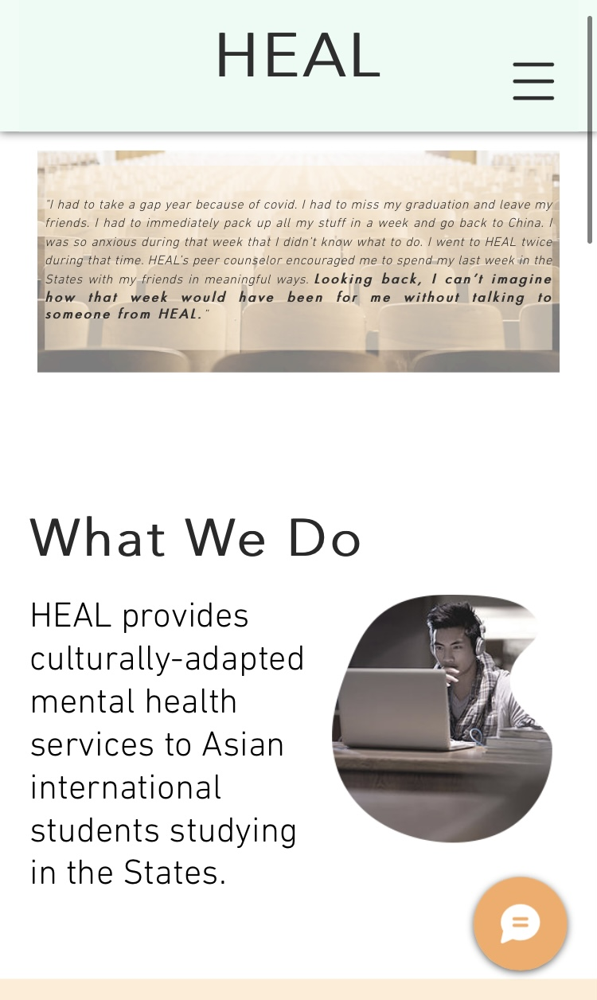
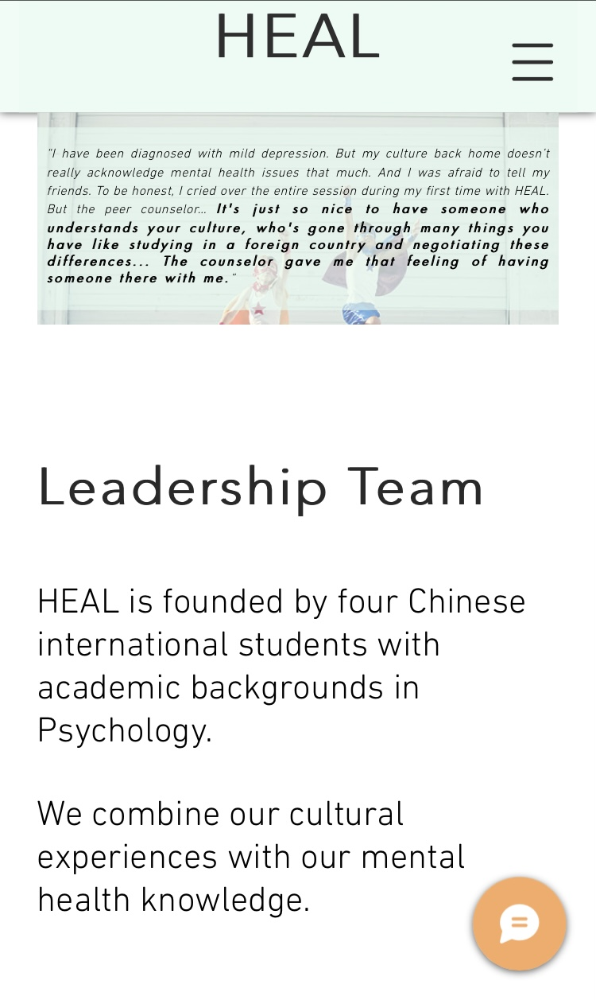
**Desktop Version**
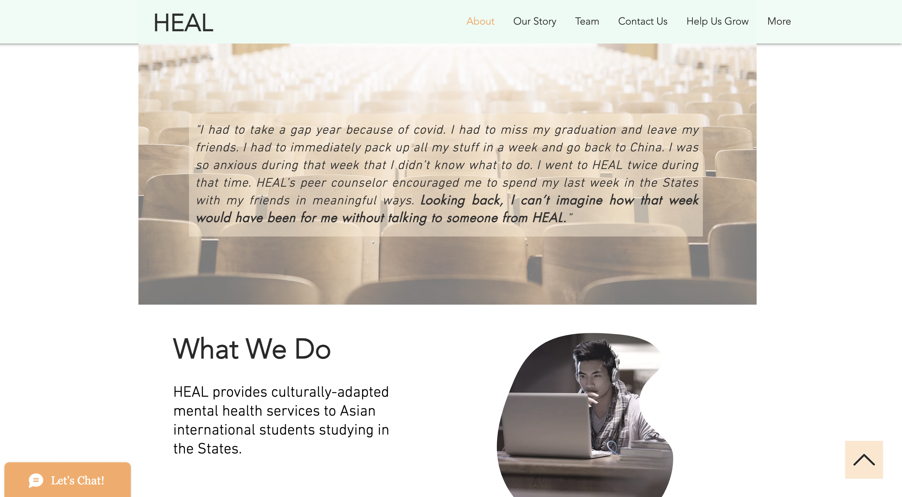
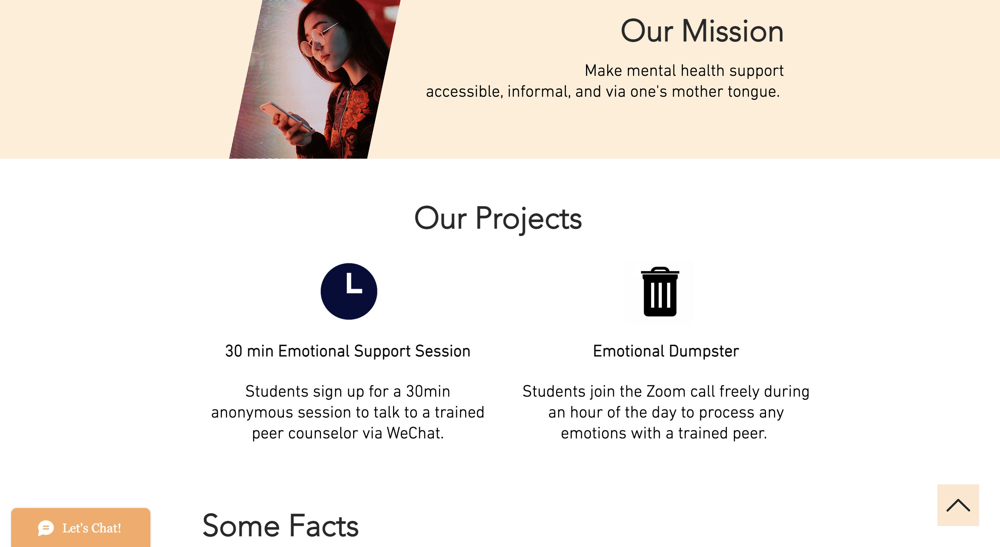

URL: www.healwithus.net

## Client Website Scope (Milestone 1)

> Your project should be ambitious, but not too large. A good rule-of-thumb is that you should have about 1 content-full page for each team member.
> Explain why the website you will create for your client isn't too small and isn't too big. Explain why you think it's the right size for this project.

On the current website, there are four webpages: About, Our Story, Team, Contact Us, and Help Us Grow. We will remove Help Us Grow and simply put the QR code of the WeChat account instead, because currently the page contains a form that can be filled out by site visitors, which is beyond the scope of what we have learned in class. After making this change, there will be four webpages in total, and each team member will be responsible for one of them.

## Client Goals (Milestone 1)

> What kind of website do they want? What are their goals for the site?
> There is no required number of goals. You need as many goals as necessary to reflect your client's desires.

-   Goal A: Showcase the website during pitch events to attract potential donors or win prizes
-   Goal B: Informing existing and potential members of the backstory of the organization as well as forming deeper connections with members
-   Goal C: Showing different sides of the organization: its WeChat account is more casual; the website will be used to release more formal information about the organization

## First Client Meeting Minutes/Notes (Milestone 1)

> Include your notes/minutes from the client meeting.

1.  Describe your organization and its purpose.

HEAL is a peer-counseling platform that provides culturally-sensitive mental health service to Asian international students in North America. HEAL was founded in May 2020. Because of the isolation caused by the pandemic and the intensified US-China relations, many international students were unable to reunite with families, causing additional mental health challenges during this already difficult time. Our team, which consists of Psychology major Chinese international students who completed two semesters of peer counseling training from Cornell, thus adapted English counseling models into a peer counseling framework that is more suitable for the Asian culture. The members of our team take turns to provide anonymous counseling services. To this date, we have already served more than 200 sessions to students across the US and Canada.

2.  What makes your organization and its services special or unique?

Mental health resources are lacking on campus; many problems are caused by cross-culture issues
The three main issues include:
1\. moving to a new country, not knowing how to openly talk to others, many counselors are not aware of this issue
2\. language barrier: not comfortable with talking about one’s most intimate issues in another language
3\. A huge stigma associated with mental health in Asian culture by international students.
They strive to create a peer counselling club for international students, in order to alleviate the stigma regarding mental health.

3.  Why are you looking for a new website or updating your existing site?
    The current website is done through WIX; the organization pays a subscription fee and there is no coding involved, which lacks flexibility.
    Member sign in option, community on website. After members sign in, they will have access to member only content
    Create a discussion forum for content sharing
    Having a webpage that is hidden, only accessible through member sign in url

4.  Who do you want to visit your site? Who is your site's target audience?

Basically four groups of people:
Our own users: asian internationals
Potential users: asian internationals who will use their services
Big and small potential donors (they are nonprofit, need donation to cover their cost)
Potential partners (schools, mental health providers)

5.  When visiting your site, what actions do you want your visitors to take?

1.To get to know us: This is an official page where people can know the backstory of the organization mission and connect further with the organization. The website represents the image of the organization
2\. Let people donate us: The WeChat account is in Chinese and is more targeted towards international students, while the website is in English and is more for partners and potential donors to let them donate to us
3\. Stay in contact with us: They want visitors to leave their contact information and add them to email lists

6.  What are your goals for this site?

Unlike content tailored, friendly WeChat, we want our website to represent our official image, for pitch events (winning prize money, etc)
The image they want is of professionalism and organized

7.  Is there a "feel" that you want for your site? Are there colors or imagery that you have in mind?

Want the “feel” to be official and professional, contrast with friendly WeChat
Have a strict color code: mint green, baby pink, baby blue (pastels)
Not a business frat or consulting site
Strike a balance between serious colors and cutesy colors.
Incorporate official logo and “cute” mascots (mascot is not used a lot, deer, penguin, frog, and one more that i missed)

8.  What are your favorite competitors or similar organizations' sites? Why?

Generally wants a website that looks cute, but professional.
Duolingo - wants to also have a different language site. English is professionalism and mandarin is more science based

# Plan/Schedule (Milestone 1)

> Make a plan of when you will complete all parts of this assignment.
> This plan is for your team. There is no required format. Format it so that it works for you!

From 27 oct - 3 dec

-   Meet with client and discuss goals, 27 oct
-   November 1 - november 5: implement content in html
-   November 5 - november 10: implement design in css
-   November 10 - november 13: implement interactivity in css
-   November 13 - november 17: check over all milestone 1 and milestone 2, for submissions
-   November 17 - november 23: user testing
-   November 23 - november 25: adjust html and css according to user testing results
-   November 26: meet with client and discuss final changes
-   November 26 - december 3: implement final changes

# Site Design/Plan (Milestone 2)

**Make the case for your decisions using concepts from class, as well as other design principles, theories, examples, and cases from outside of class.**

You can use bullet points and lists, or full paragraphs, or a combo, whichever is appropriate. The writing should be solid draft quality but doesn't have to be fancy.

## Understanding Users (Milestone 2)

### Audience (Milestone 2)

> Briefly explain your site's audience. Be specific and justify why this audience is a cohesive group with regard to your client's site. This audience should not be overly broad nor arbitrarily specific. It should be a cohesive group with similar _goals_.

International Chinese Cornell Students

### User Interview Questions (Milestone 2)

> Plan the user interview which you'll use to identify the goals of your site's audience.

**User Interview Briefing & Consent:** Hi, I am a student at Cornell University. I'm currently taking a class on web design and for a project I am (re-)designing a web site for _client's name_. I'm trying to learn more about the people that might use this site. May I ask you a few questions? It will take about 10-15 minutes. You are free to quit at any time.

1.  Please tell me a bit about yourself and your experience at Cornell.

2.  Think of a mental challenge you've faced. Did you seek help? Where did you seek help?

3.  What are the factors that affect your decision of seeking for help when you meet a mental challenge?

4.  What brought to Cornell, what attracts you about Cornell?

5.  Tells us a time where you faced a challenge and how you overcame it?

6.  Have you ever sought online mental health resources before?

7.  How important is mental health to you?

8.  What are the barriers to mental health help that currently exist to you?

9.  How often do you feel stressed or depressed?

10. How does living away from home impact your mental health?

**After the interview:** This was really helpful. Thank you so much for agreeing to speak with me today. Have a great day!

### Interview Notes (Milestone 2)

> Interview at least 4 people from your audience. Take notes and include those notes here. Make sure to include a brief description of each interviewee.

**Interviewee 1:**

Description: freshman in arts and sciences, double majors in info sci and sociology.

Notes:  pretty positive experience, having a good time. no major mental challenges at Cornell, and friend's here from home and from family. she thinks she shouldn't be contacting the Cornell crisis line when she's not in grave danger and also and she heard that she doesn't really work and that it doesn't really work. Cornell was my best options out of my schools, and it has a lot of resources and a strong network. when i applied to clubs, i was challenged to stand out because she was rejected and she overcame it was through. yes, the student organized. very, because "in order to girlboss you need to be at a hundred percent". the inaccessibility of mental healths support, and it'll be a useless bureaucratic process. when the work starts piling up, but not often

**Interviewee 2:**(Marco)

Description: Chinese international Cornell student majoring in computer science. Came to the USA ten years ago and went to a High School in Philadelphia. Lived with homestay parents and adapted quickly to America.

Notes: Obtained mental support from host family and rarely felt stressed. Freshman year at Cornell was very smooth to him. He has never sought online mental health resources but he knows friends who sought mental health. However, mental health support at Cornell is very inconvenient from his friend's experience as she had to wait a two month long queue. Believes that mental health is important but it is not very accessible or convenient to others. Claims that people are scared away by the wait time of the queue than the stigma behind mental health. Mental health priorities undergraduate students, while most Chinese international students are graduate students. Does not feel too stressed by Cornell environment as he is very resilient and adapts. Transitioning to America was not too impactful for him as he did not live with his native parents too long and was greatly accommodated to his host family.

**Interviewee 3:**

Description: Chinese international Cornell student studying computer science. Went to a boarding school in Texas and is used to living away from home.
Notes:

-   Felt stressed out last semester, suffered from insomnia and often cried at night. Online classes felt weird because they did not provide a good learning environment. Also had pressure from parents, relationship, and self-expectations.
-   Sought support and advices from friends, met with high school friends during weekend which provided a sense of belonging
-   Looked up online mental health resources on campus and therapists a while ago, didn't really trust therapists before, looked up symptoms of mental disorders.
-   A common barrier to mental health is not actively looking for help, but there are many mental health resources on campus

**Interviewee 4:**(Danni)

Description: A Chinese international Cornell student who is a sophomore with a double major in Math and Economics. Went to regular Chinese high school and attended Cornell University.
Notes:

-   Felt depressive everyday and was hard to sleep well during the night. Was not confident enough on herself and was very confused about the future career path. The peer pressure was really heavy that made her doubt about her ability in academic performance. Due to COVID-19, she was unable to go back to her home, and she missed her home so much.
-   Tried to approach to the Cornell mental health counseling to seek for help, but the process is very sophisticated and need to pay money if the counseling time exceed a certain amount. Therefore, she ended up not going to Cornell Health again. She talked with her peers to alleviate pressure. Although her peers encouraged and supported her enough, she was still unable to get rid of the depressive emotions all the day.
-   A barrier of solving mental health problem is that there are not enough resources on campus. Students tried to seek help but the result was not satisfactory. Moreover, due to the culture difference, the counselors some times can't understand the student's actual feeling. Due to some language barrier, student can't express their feelings and thoughts all by English.

**Interviewee 5:**
Description: Chinese international student studying information science. Has never lived away from parents before college.
Notes: Overall has very good mental health, but feels stressed and overwhelmed sometimes due to academic pressure. Taking six classes this semester and suffers from lack of sleep. When feeling stressed, talk to families and friends. Has never felt the need to seek online mental health resources or therapists, but thinks mental health problems are common on campus and should raise more awareness. "I think it is okay to feel stressed or down sometimes, but it is important to adjust your mindset so you don't get drowned in negative emotions for a long time. I'm able to overcome this myself, but I know that many people do need outside help with this. Students should have a place or platform where they can share their troubles or whatever's going on in their life safely and openly."

### Goals (Milestone 2)

> Analyze your audience's goals from your notes above. List each goal below. There is no specific number of goals required for this, but you need enough to do the job (Hint: It's more than 1 and probably more than 2).

Goal 1: Being informed of what services the organization provides

-   **Design Ideas and Choices** _How will you meet those goals in your design?_
    -   Explicitly lists out all the past events and ongoing services that the organization provides
-   **Rationale & Additional Notes** _Justify your decisions; additional notes._
    -   Interviewees mentioned that sometimes they don't know where to seek help and the mental health support on campus is not accessible, so Heal should advertise itself as a useful mental health resource.

Goal 2: Seeing proofs of the organization's authenticity

-   **Design Ideas and Choices** _How will you meet those goals in your design?_
    -   Includes images of the club presenting at conferences and pitch events
    -   Has a Our Story page that explains how the club was founded
    -   Includes terms and conditions about how participants' privacy is protected
-   **Rationale & Additional Notes** _Justify your decisions; additional notes._
    -   Talking about one's mental health issue requires putting trust in the listener, so the club needs to establish a authentic image and make it clear that students can talk to them without worrying about their privacy.

Goal 3: Connects with the club and get to know it beyond its website

-   **Design Ideas and Choices** _How will you meet those goals in your design?_
    -   Include the club's WeChat account QR code in the Contact Us page
-   **Rationale & Additional Notes** _Justify your decisions; additional notes._
    -   As the new website we design has limited interactivity and does not include forms, it is important that users know how to reach out to the club. Heal's mainly uses its WeChat account to connect with its users, so it is important to include their account's QR code so that students can follow them can talk to them on WeChat.

## Content Planning (Milestone 2)

**Plan your site's content.**

### Your Site's Planned Content (Milestone 2)

> List the content you plan to include your personal website. This should be a comprehensive list.

-   our mission statement
-   introduction of organization
-   contribution of organization
-   the vision and mission of the organization
-   statistics of organization
-   images of students
-   quotes from current members
-   a paragraph of organization story
-   introduction of team members
-   images of team member
-   contact information
-   WeChat serve support
-   WeChat QR code
-   student support session button
-   terms and conditions

### Content Justification (Milestone 2)

> Explain (about a paragraph) why this content is the right content for your site's audience and how its addressed their goals..

This content is the right content for our site's audience. It has adequate contact information for the clients as well as the contact information for the investors. For the investors, it has an introduction of their organization, as well as the contributions they've made. they also include a vision and a mission for those who are interested in that subject, and images to help humanize the topic. on the topic of humanization, they also include quotes from current members as well as a paragraph of the organization story. the contact information is also there, for those wanting to get involved in the organization. within this additional field, they also have WeChat serve support, as well as WeChat QR code. lastly, the terms and conditions exist for those wanting to more about the legalities of the site.

## Information Architecture (Milestone 2)

### Content Organization (Milestone 2)

> Document your iterations of card sorting here.
> Include photographic evidence of each iteration of card sorting and description of your thought process for each iteration.

First we had each member write down ideas for the content of the website and then we scrambled the  cards around.

Then we organized the cards into generic categories such as text, links, and images.

Finally, we thought of ideal webpages categories, then we organized the cards to match to each webpage.

### Final Content Organization (Milestone 2)

> Which iteration of card sorting will you use for your website?

We will use the last card sorting interaction.

> Explain how the final organization of content is appropriate for your site's audiences and their goals.

The final design perfectly captures all the information requested from the site's audience. Our most prominent page is the home page, which is where people are going to spend most of their time. The home page contains most of the information needed to help the client's target audience. The our team page is also important, as it will allow users to get to know the team behind the organization better, which builds confidence between the users and the website. The Contact Us page is also very important as allows suers to quickly get access to mental health support and assistance.

### Navigation (Milestone 2)

> Please list the pages you will include in your personal website navigation.

-   Home Page
-   Our Story Page
-   Our Team Page
-   Contact Us

> Explain why the names of these pages make sense for your site's audience and their goals.

The home page is named the home page because its where the user first sees when they enter the website. the our story page employs the don't make me think aspect of web design, where the user automatically expects what to expect - a story about their organization. This is the same for our team, showing pictures and information about the team members. lastly, the contact us page is aptly named, because it has all the information for the contact us page.

The second page is our story. Having this page is important for the website because it tells the story of how the club was founded, adding more life to it. In this page, users will obtain information about why there is a need to provide mental health resources for international Asian students and how the founders started putting their ideas into reality.

The third page is named Team. This page shows the leadership team member of Heal by incorporating the headshot and the description of each team member. The audiences can have a comprehensive understanding of the background, positions, and vision of each team member of Heal. This page presents a positive image of the founder team of Heal and is a good place to show this good team image to the audiences who  are potential investors and potential clients.

Contact us page has all what the person needs to contact the user. we have the contact information of the WeChat, as well as any additional information with the terms and conditions.

## Design (Milestone 2)

### Visual Theme (Milestone 2)

> Discuss several (more than two) ideas about styling your site's theme. Explain why the theme ideas are appropriate for your target audiences.
> Note the theme you selected for you site and why it's appropriate for the audience and their goals.

Idea 1: Professional

-   The website will follow a strict color code: mint green, baby pink, and baby blue
-   The wordings will be written and professional
-   This theme is appropriate because the website will be showcased during pitch events and to potential investors, so being professional will help establish a good image for the organization.

Idea 2: Energetic

-   The website will use warm colors and a variety of animated fonts to convey a sense of approachability
-   This theme is appropriate because as a club for mental health resources, it should convey positiveness. Using warm colors and cheerful elements will help achieve this.

Idea 3:  Friendly

-   Similar to the club's WeChat official account, the new website will include many visuals such as the club's mascots and logos as well as icons. A lot of interactivity design will also be implemented, such as chatbot and interest form.
-   This theme is appropriate because the website will establish a consistent image as the WeChat account, and being friendly will makes its services more acceptable to potential participants.

We will implement the professional theme because the client prefers to have an official website that contrasts with their WeChat account. The website is also used to establish authenticity of the club, so it should be informational and well-organized.

### Interactivity Ideas (Milestone 2)

> Brainstorm several ideas for your site's interactivity.
> Provide a very brief summary how each idea improves the usability of the site for the site's audience.

-   Hamburger menu:
    Great for mobile design as it allow users to easily navigate through the site.
-   Carousel:
    Display a lot of information and retains user's attention by allowing them to click through.

-   Show More link:
    Enables long paragraphs to not obstruct or break the flow of the website.

-   Drop down menu:
    Makes content more organized and appear professional

### Layout Exploration (Milestone 2)

> Iterate on your site's design through sketching.
> Sketch both the mobile and desktop versions of the site.
> Here you are just exploring your layout ideas. You don't need to sketch every page.
> Provide an explanation for each sketch explaining the idea and the design patterns you are leveraging.

**Home Page**

For the desktop design we first tried to lay out the elements and try to make a conventional website based off what we learned. These sketches allow us to visual the HTML and CSS we need in order to implement our design.

**Our Story**
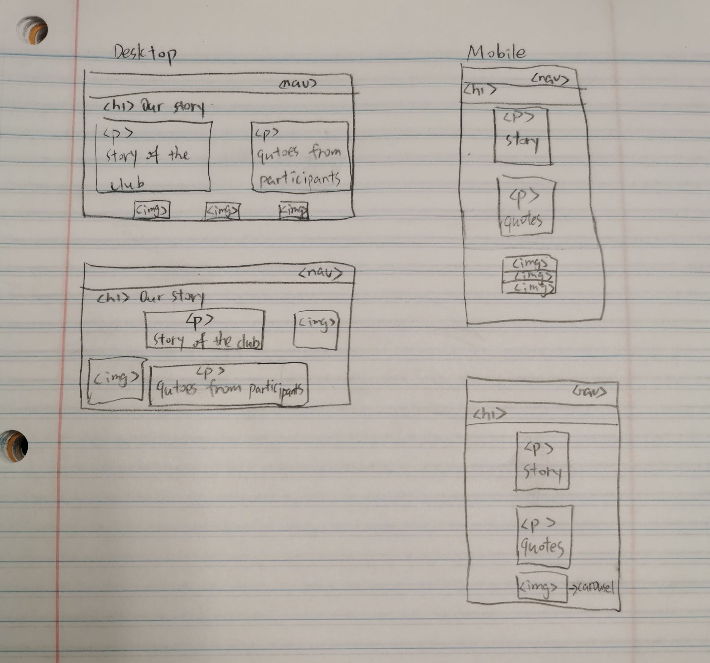

-   For both the desktop and mobile design, there is a combination of texts and images. The text for introducing the club's story and quotes from participants will be in two separate boxes so that it's easy to arrange them. The images will either be at the bottom or the two sides of the screen as visual decoration to the page, but they do not really have any significant meanings.

**Team**

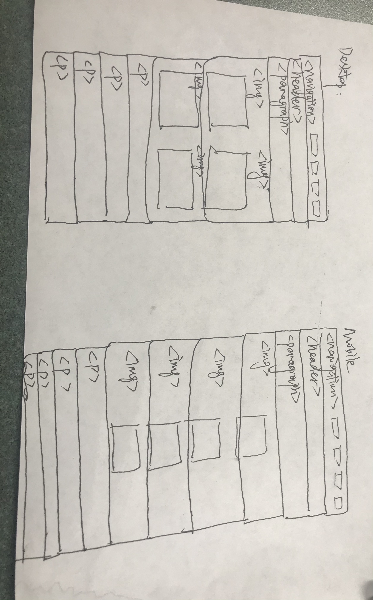

-   The design of the team page on desktop and mobile design will be incorporated with texts and images. I will pair the photo of each team member with the description of the corresponding team number. The photo and text are in flexboxes. The image of the team member will be arranged either next to the description paragraph or at the top half of the team page.

**Contact Us**
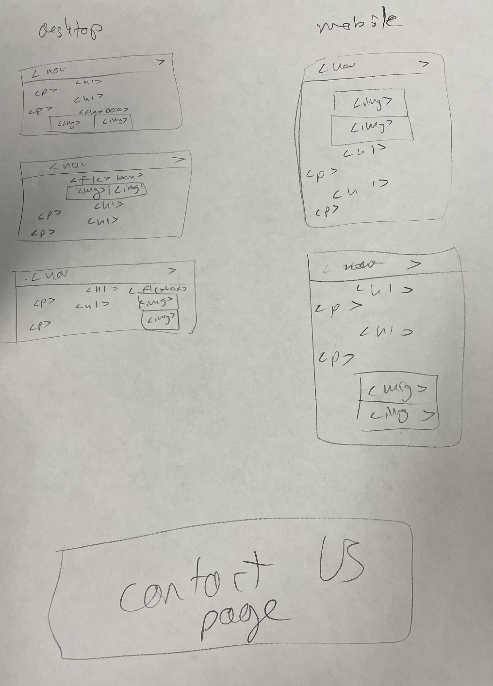
for the mobile set up, i made sure to use the vertical space available by placing all the content top to bottom. for the desktop version, i made use of the horizontal space, and made sure to place the terms and conditions on one part of the screen, then the img's stacked vertically on the right side of the screen.

### Final Interactivity Design (Milestone 2)

> Explain and/or provide annotated sketches of the interactivity you will implement for your site.
> Explain how the interactivity improves the usability of the site and helps the site's audiences meet their goals.

Hamburger menu

-   For the mobile design a hamburger menu is very useful as it allows the navigation bar to be neatly stored and retrieved when needed without taking too much fo the mobile screen. Additionally, hamburger menus are very commonly used so they would bring familiarity.

Carousel

-   A carousel would be very effective way to display a great deal of information to users and keep their attention and pique their curiosity through its interactive use of buttons.

Show More link

-   Through "show more" links we will be able to store more content to our site without making it take too much space.

### Final Design (Milestone 2)

> Include the final sketches for **each** of your site's pages.
> The sketches must include enough detail that another 1300 student could implement them.
> Provide a explanation for each sketch.

**Mobile Design:**

_Home Page_

-   We neatly divided the essential elements of the mobile design. The general flow of the the mobile design is vertically, so we tried to minimize as many elements displayed horizontally and used 
 elements to organize our content. We also included the hamburger menu interactivity and the plans We have for the html elements it will consist. The navigation bar will generally be hidden until the button is clicked.

_Our Story_
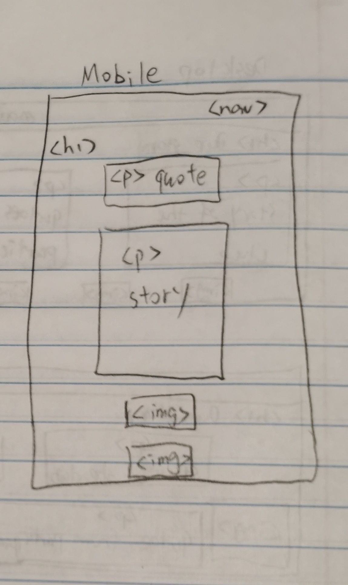

-   The quote will be placed before the paragraph for the club's story to intrigue viewers, and the images, possibility logos or the club or pictures from past events, will be placed at the bottom of the screen.

_Team_
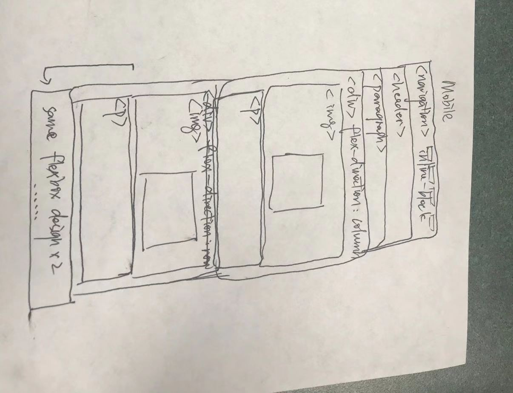
\-The design of the team page on desktop and mobile design will be incorporated with texts and images. I will use flexbox to lay out the texts and images. In each flexbox, there is a team member image and a paragraph that describes the team member. In mobile design, I will set the flex-direction to column to make the image and the paragraph in column row to adjust to the mobile screen.

_Contact Us_
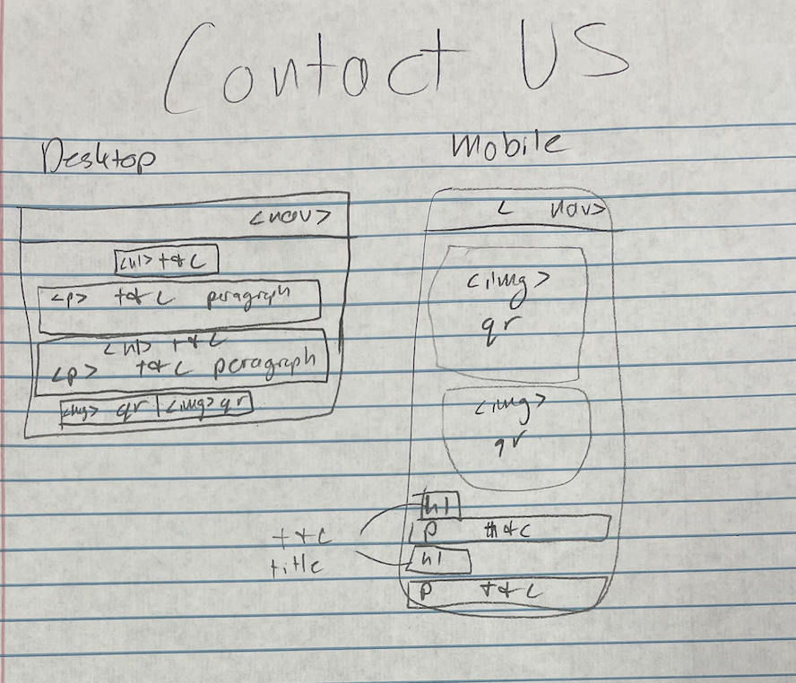

-   for the mobile version, i employed the same use of vertical spacing, placing the most important content at the top, and the least important on the top. this way, i made use of pathing, where the user intuitively knows how to navigate the site.

**Desktop Design:**

_Home Page_

-   On the top, the navigation bar will be situated consisting of the elements presented. A carousel will also be included using a a variety of `
` and ``elements. Most of the content will be wrapped in a `
` elements and organized using flex boxes.  plan to utilize

_Our Story_
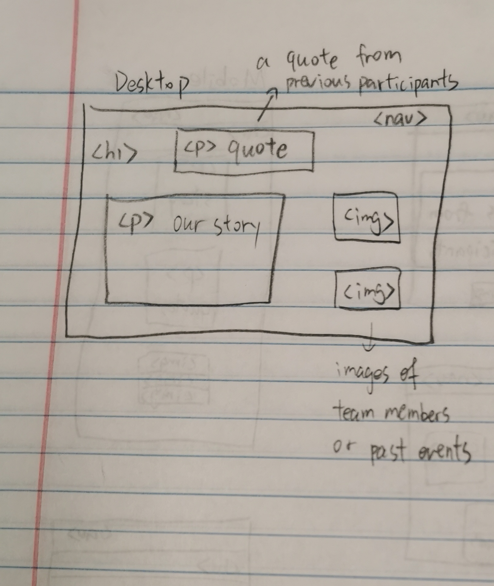

-   The quote will be placed right under the title, followed by the paragraph describing the club's story. The images will be in aside element and on the right side, acting as complement to the texts.

_Team_
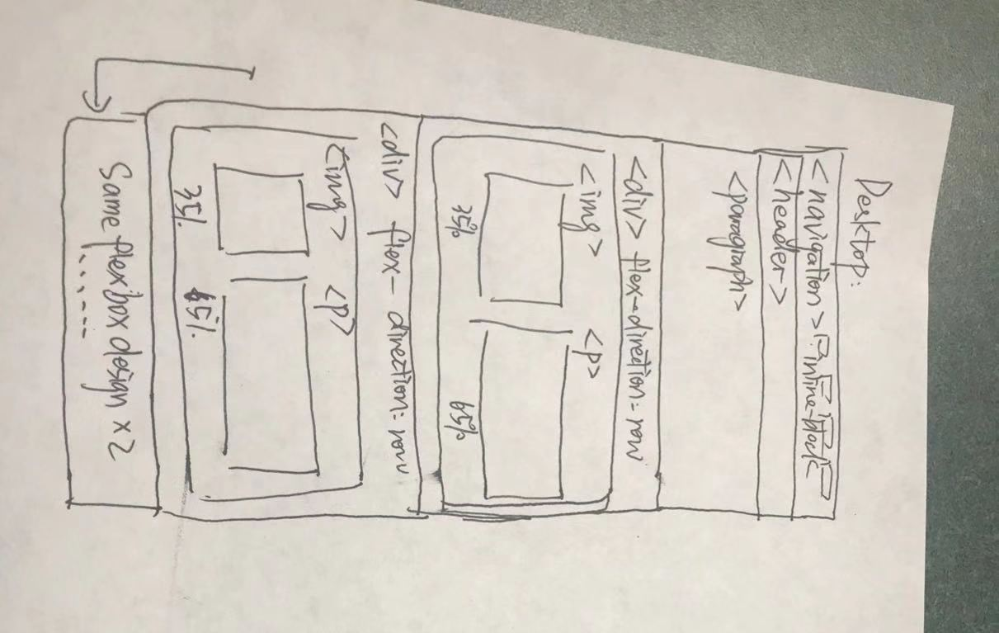

-   The design of the team page on desktop and mobile design will be incorporated with texts and images. I will use flexbox to lay out the texts and images. In each flexbox, there is a team member image and a paragraph that describes the team member. In desktop design, I will set the flex-direction to row to make the image and the paragraph in the same row. I will also adjust the margin to make the paragraph be put in the middle.

_Contact Us_

-   for the desktop version, i simply stacked the terms and conditions content above the QR, because i felt like it was less intuitive for the user to navigate, as opposed to the horizontal space used.

### Design Rationale (Milestone 2)

> Explain why your design is appropriate for your audience. Specially, why does your content organization, navigation, and site design/layout meet the goals of your users? How did you employ design patterns to improve the familiarity of the site for your audience?

For the content organization, our content includes all the information requested from the site's audience. Our most prominent page is the home page, which contains most of the information about the introduction of the organization and the services provided by the organization. These are the information that audiences most concern about. The ourstory page tells the story of how the club was founded, and let the audiences know why addressing mental health problem is significant. Our team page demonstrate the leadership team of the organization, which conveys a positive image to the audiences. The Contact Us page have the information of WeChat QR code to make the audiences connects with the club and get to know it beyond its website. The navigation corresponds to the content of each webpage, which makes users easily and quickly target the page that they want to look for more information. For the design, we chose to use professional style on the website. Because the website is also used to establish authenticity of the club. The professional style makes it informational and well-organized. In terms of layout, we use 
 elements and flexboxes to organize the content. We incorporated both images and text in the flexbox to enrich the content of the webpage and make them easy for audiences to follow. We have designs for both desktop and mobile, which makes our website convenient to access through different devices. Furthermore, our design implements a number of key elements that will make it easier for users to navigate the website. For example, the carousel and hamburger menu.

## Interactivity Plan (Milestone 2)

> Now that you've designed your interactivity for your site, you need to plan how you will implement it.
> Describe how you will implement the interactivity. This should be a complete plan that another 1300 student could use to implement the interactivity.
> You should list the elements, any CSS classes, events, pseudocode, and the initial state.

For the mobile design, in the initial state the navigation bar will be hidden.
For the carousel, all of the slides except for the first one will be hidden upon loading the page.
**HTML ELEMENTS**

-   hamburger menu button: `<button id='hamburger-button' class='hamburger-menu'>`
-   header: `<header id = "navigation-bar" class = "hidden-bar">`
-   hamburger-menu nav: `<nav class="navigation-buttons">`
-   hidden paragraphs: `
`
-   div with slides:

    

      
      
      
    

-   carousel right button: `<button id="right-button" class = "carousel-button">`
-   carousel left button: `<button id="left-button" class = "carousel-button">`

**CSS ELEMENTS**

-   `.hamburger-menu` - match website colors, sticky position, high z-index,
-   `.hamburger-menu:hover` - change to darker background color.
-   `.hidden` - display: none.
-   `.hidden-bar` - hide navigation bar for mobile design but displays for desktop design.
-   `.carousel-button` - adjust size and appearance to make it look like a button. Modify font size of arrow.

**PSEUDOCODE**

    Hamburger-Menu:
    when #hamburger-button is clicked do:
    if #navigation-bar has the class .hidden-bar
      remove .hidden-bar class from #navigation-bar
    else
      add .hidden-bar class to #navigation-bar

    Carousel:
    when #right-button is clicked do:
      add .hidden class to current slide
      then:
      remove .hidden class from the next slide

      when #left-button is clicked do:
        add .hidden class to current slide
        then:
        remove .hidden class from the previous slide

        after 10000 seconds automatically move to the next slide.

## Client Feedback & Minutes (Milestone 2)

> You should meet with your client again to obtain feedback on your design.
> Provide a summary of the client's feedback and your meeting's minutes.

0:28 Likes the animation on the home page where it automatically switches between images
0:50 Could change the layout of the texts on Our Story so the texts don’t look so overwhelming
1:30 Likes the clean aesthetic and the familiar aesthetic. Feels approachable
1:35 Thought the our story page looked a little blank.
1:50 Likes the layout on Team page, where the position of image and texts alternates for each member introduction
2:25 Bigger font size and different font style
2:50Likes the colors used, but plans on using a different color palette. Unsure of the current colors used.
3:15 Like the navigation bar because it is easy for the users to target the content that they are interested in

Overall satisfied with the content and formatting of website. Commented on minor changes in website, but no major flaws detected.

# Evaluation (Final Submission)

## Finished Desktop & Mobile Website (Final Submission)

> Include screenshots of both the desktop and mobile version of your site that you will be using for user testing. (We need to see the "before" testing version of your site.)
> Use the FireFox screenshot feature to take screenshots of the entire page.

**Mobile Screenshots:**

_Home Page_
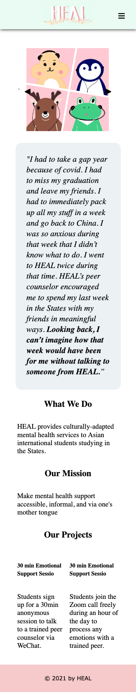

_Our Story Page_
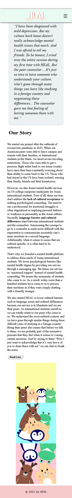

_Team Page_
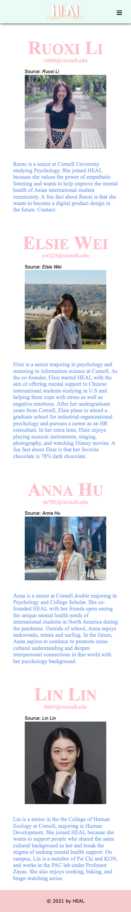

_Contact Us Page_
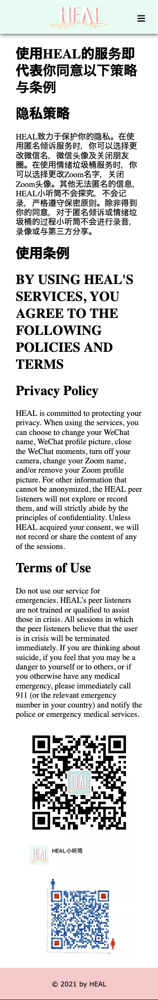

**Desktop Screenshots:**

_Home Page_
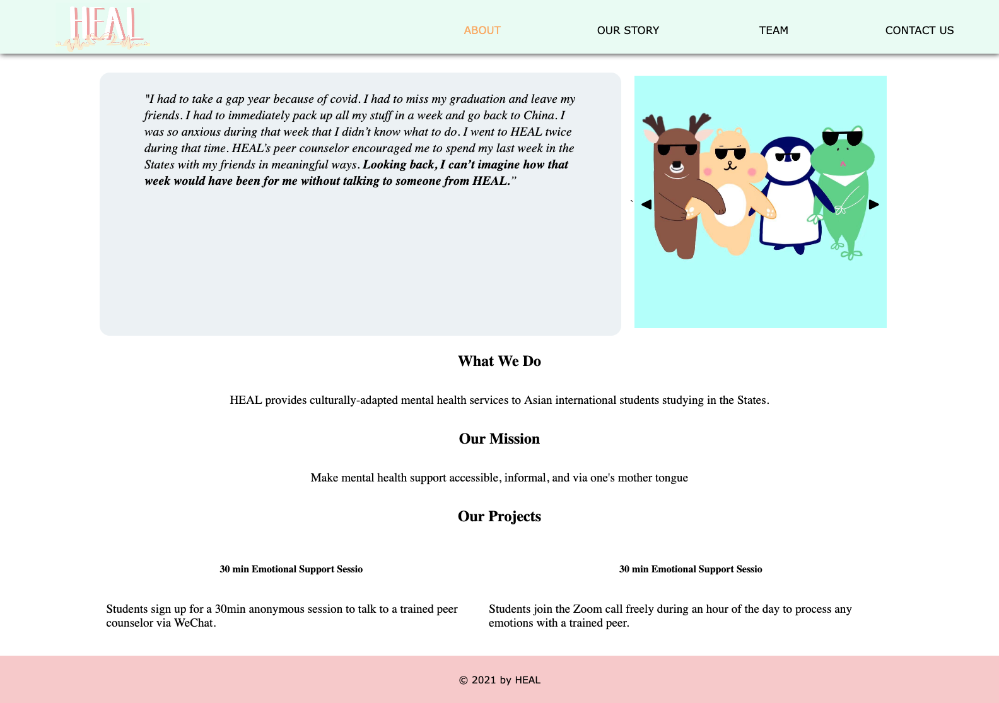

_Our Story Page_
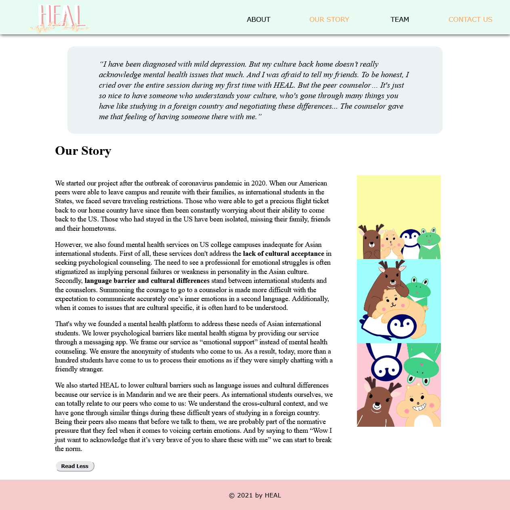

_Team Page_
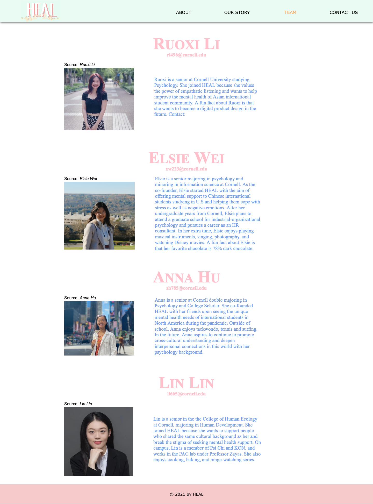

_Contact Us Page_
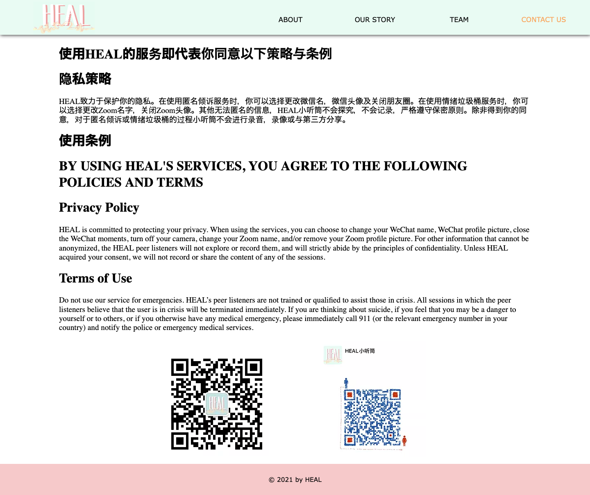

## User Testing (Final Submission)

**Conduct user testing with a minimum of 4 participants.**

### User Testing Tasks (Final Submission)

> Plan out your user testing tasks before doing your user testing. These must be actual user testing tasks. **Tasks are not questions!**

1.  Locate the QR code for HEAL’s WeChat official account.

2.  Identify two reasons why mental health services on US college campuses are inadequate for Asian international students

3.  You are interested in knowing more about the founders of Heal, locate the contact information of the team members

### User 1 - Testing Notes (Final Submission)

> When conducting user testing, you should take notes during the test. Place your notes here.

Task #1
 - View the Our Story page really fast
 - Goes to the Contact us page and points to the QR code

Task #2
- Views and investigates the Home page
- Then clicks on the Our Story page
- Points out the bold information on the Our Story page
- Says that the two reasons are lack of cultural acceptance and language barrier and cultural differences

Task #3

 - Goes to contact page, look for a while
 - Then goes to the Team page and points to the email address under the name of each co-founders

### User 1 (Final Submission)

> Using your notes from above, describe your user by answering the questions below.

1.  Who is your user, e.g., where does the user come from, what is the user's job, characteristics, etc.?

- The user is a sophomore student studying pre-med at Cornell and she comes from China.

2.  Does the user belong to your audience of the site? (Yes / No)
    > If “No”, what’s your strategy of associating the user test results to your audience’s needs and wants? How can your re-design choices based on the user tests make a better fit for the audience?

- Yes

### User 1 Results (Final Submission)

> Report the results of your user's test. You should explain **what the user did**, describe the user's **reaction/feedback** to the design, **reflect on the user's performance**, determine what **re-design choices** you will make **for EACH task**. You can also add any additional comments.

Task: Locate the QR code for HEAL’s WeChat official account.

-   **Did you evaluate the desktop or mobile design?**
    -   Desktop
-   **How did the user do? Did they meet your expectation?**
    -   The user scrolls down the Home page. Look again thorougly and then views the Our Story page really fast. Finally, she goes to the Contact us page and points to the QR code. The user's spend more time finishing this task than I expected.
-   **User’s reaction / feedback to the design** (e.g., specific problems or issues found in the tasks)
    -   The user spent some times on viewing the home page and our story page rather than quickly locate the information of the QR code on contact us page. The user said that she didn't understand the meaning of "QR code" at first, which makes her spend some times on other pages.
-   **Your reflections about the user’s performance to the task**
    -   The user's spend more time finishing this task than I expected, which might indicate that the label of the QR code is not clear for her.
-   **Re-design choices**
    -   Add some indication for the QR code, e.g. add a label of "click here to scan the QR code"
-   **Additional Notes**
    -   The label will help the user to locate the contact information faster and easier

Task: Identify two reasons why mental health services on US college campuses are inadequate for Asian international students

-   **Did you evaluate the desktop or mobile design?**
    -   Desktop
-   **How did the user do? Did they meet your expectation?**
    -   Views and investigates the Home page. Then clicks on the Our Story page. She quickly points out the bold information on the Our Story page and says that the two reasons are lack of cultural acceptance and language barrier and cultural differences.
-   **User’s reaction / feedback to the design** (e.g., specific problems or issues found in the tasks)
    -   User finds this task really simple and easy
-   **Your reflections about the user’s performance to the task**
    -   The user completed this task extremely fast, which shows the bold design on "Our Story" Page is very effective.
-   **Re-design choices**
    -   Bold the "mental health services on US college campuses inadequate for Asian international students" on Our Story page.
-   **Additional Notes**
    -   Bolding the sentence to emphasize the significance of heal on helping international asian students.

Task: You are interested in knowing more about the founders of Heal, locate the contact information of the team members

-   **Did you evaluate the desktop or mobile design?**
    -   Mobile
-   **How did the user do? Did they meet your expectation?**
    -   Goes to contact page, look for a while. Then goes to the Team page and points to the email address under the name of each co-founders
-   **User’s reaction / feedback to the design** (e.g., specific problems or issues found in the tasks)
    -   User found the task very simple and considers the email address under the name of each co-founder is very apparent and easy to locate.
-   **Your reflections about the user’s performance to the task**
    -   Although the user first looks at the contact us page, she still successfully locates to the team page quickly after she doesn't find the founder's information on Contact US page, which means the design is OK.
-   **Re-design choices**
    -   Add a description of the team at the top of the team page
-   **Additional Notes**
    -   The description can make the audience get a overview of the founder team and then explore more about each individual co-founders.

### User 2 - Testing Notes (Final Submission)

> When conducting user testing, you should take notes during the test. Place your notes here.

Notes:

Task #1
 - Looks and investigates the Home page.
 - Assumes that QR code is in Contact Us page
 - Goes to contact us page.
 - Finds QR codes.
 - Comments on how simple that was.

Task #2
 - Looks at the home page for informational
 - Does not find anything
 - Goes to the Our Story page.
 - Hesitant to read large text.
 - Start reading the paragraph to obtain more information.
 - Eventually finds the bolded statements he was looking for.
 - Comments are tucked in between a large wall of text.
 - Suggests organizing and structuring the paragraph better.
 - Suggests using bullet points for the statements

Task #3
 - Immediately goes to the Team page.
 - Starts looking and reading the short biographies from the team members.
 - Suggests that the team members should be organized as to present the members in order of hierarchy.(e.g. co-founders first, members, and so on.)

### User 2 (Final Submission)

> Using your notes from above, describe your user by answering the questions below.

1.  Who is your user, e.g., where does the user come from, what is the user's job, characteristics, etc.?

Freshman Cornell Student from Massachusetts studying Computer Science at the School of Arts and Sciences.

2.  Does the user belong to your audience of the site? (Yes / No)
    > If “No”, what’s your strategy of associating the user test results to your audience’s needs and wants? How can your re-design choices based on the user tests make a better fit for the audience?

No, however my user is of Chinese decent and fully understands the situation regarding Chinese international students coming to study at Cornell University. He is also friends with international students so he can recommend this website's services to them.

### User 2 Results (Final Submission)

> Report the results of your user's evaluation. You should explain **what the user did**, describe the user's **reaction/feedback** to the design, **reflect on the user's performance**, determine what **re-design choices** you will make **for EACH task**. You can also add any additional comments.

Task: Locate the QR code for HEAL’s WeChat official account.

-   **Did you evaluate the desktop or mobile design?**
    -   Desktop
-   **How did the user do? Did they meet your expectation?**
    -   Yes, he was able to quickly find the QR codes in the Contact Us page.
-   **User’s reaction / feedback to the design** (e.g., specific problems or issues found in the tasks)
    -   The user did not have much problems finding the QR codes, but they were a bit too small for him.
-   **Your reflections about the user’s performance to the task**
    -   It was good that finding the QR code was not a hard task.
-   **Re-design choices**
    -   I plan to make the QR codes slightly bigger and add labels.
-   **Additional Notes**
-   By adding labels to the QR code it would make it clear what each QR code means.

  Task: Identify two reasons why mental health services on US college campuses are inadequate for Asian international students
-   **Did you evaluate the desktop or mobile design?**
    -   Desktop
-   **How did the user do? Did they meet your expectation?**
    -   It took a while for the user to find the information.
-   **User’s reaction / feedback to the design** (e.g., specific problems or issues found in the tasks)
    -   The user suggests organizing and structuring the paragraph, such as by adding bullet points, to make it easier to digest the long paragraphs.
-   **Your reflections about the user’s performance to the task**
    -   I think think that the user was able to successfully perform the tsk, but admitted that looking at the large wall of text was intimidating and deterring.
-   **Re-design choices**
    -   I plan restructure the paragraph and add some bullet points.
-   **Additional Notes**
    - Does this will make it easier for the user to locate key information and less intimidating for users to digest the information presented.

Task: You are interested in knowing more about the founders of Heal, locate the contact information of the team members
-   **Did you evaluate the desktop or mobile design?**
  -   Desktop
-   **How did the user do? Did they meet your expectation?**
  -   Yes, the user was able to quickly go to the desired page and locate the information requested.
-   **User’s reaction / feedback to the design** (e.g., specific problems or issues found in the tasks)
  -   The user believes that the order the members were presented did not make logical sense.
-   **Your reflections about the user’s performance to the task**
  -   The user made many valid suggestions and was able to quickly perform the tasks.
-   **Re-design choices**
  -   I plan to reorder the position of team member.
-   **Additional Notes**
  - Reordering the team members position in the page will allow users to more chronologically follow the origins of the organization.

### User 3 - Testing Notes (Final Submission)

> When conducting user testing, you should take notes during the test. Place your notes here.

Task 1: The user first quickly scrolled through the about page, then jumped to the Contact Us page, found the QR code at the bottom of the page, but questioned that some people might not know what a WeChat QR code look like if they have never used WeChat before.
Task 2: The user first started in the Our Story page, and explained that the reasons are probably related to why the organization was founded, so she looked at the Our Story page
Task 3: The user started on the Team page, and quickly scrolled through the entire page, then identified the members' emails

### User 3 (Final Submission)

> Using your notes from above, describe your user by answering the questions below.

1.  Who is your user, e.g., where does the user come from, what is the user's job, characteristics, etc.?

Sophomore studying Info Sci and Econ from China.

2.  Does the user belong to your audience of the site? (Yes / No)
    > If “No”, what’s your strategy of associating the user test results to your audience’s needs and wants? How can your re-design choices based on the user tests make a better fit for the audience?

Yes

### User 3 Results (Final Submission)

> Report the results of your user's evaluation. You should explain **what the user did**, describe the user's **reaction/feedback** to the design, **reflect on the user's performance**, determine what **re-design choices** you will make **for EACH task**. You can also add any additional comments.

Task:
1.  Locate the QR code for HEAL’s WeChat official account

2.  Identify two reasons why mental health services on US college campuses are inadequate for Asian international students

3.  You are interested in knowing more about the founders of Heal, locate the contact information of the team members

-   **Did you evaluate the desktop or mobile design?**
    -   desktop
-   **How did the user do? Did they meet your expectation?**
    -   The user quickly completed all the task and exceeded my expectation, because I thought the second task would take a relatively long time, but the user finished it within seconds.
-   **User’s reaction / feedback to the design** (e.g., specific problems or issues found in the tasks)
    -   The user liked the design in general, but suggested that important information could be bolded, and there should be a better combination of texts and graphics.
-   **Your reflections about the user’s performance to the task**
    -   The user had a very good understanding of the tasks and is able to quickly locate the desired information. The user knew that it's important to decide which webpage to look at first, and then find the relevant details.
-   **Re-design choices**
    -   I bolded more texts on Our Story page and added two pictures.
-   **Additional Notes**
    -   Bolding texts will allow users to easily spot important information.

### User 4 - Testing Notes (Final Submission)

> When conducting user testing, you should take notes during the test. Place your notes here.

User goes to contact, immediately finds QR code

Goes to ourstory and finds the paragraph

Goes to contact us

Goes to team, finds the users.

### User 4 (Final Submission)

> Using your notes from above, describe your user by answering the questions below.

1.  Who is your user, e.g., where does the user come from, what is the user's job, characteristics, etc.?

My user is a Cornell student, freshman, and is from the college of engineering.
he is an asian international student

2.  Does the user belong to your audience of the site? (Yes / No)
    > If “No”, what’s your strategy of associating the user test results to your audience’s needs and wants? How can your re-design choices based on the user tests make a better fit for the audience?

Yes

### User 4 Results (Final Submission)

> Report the results of your user's evaluation. You should explain **what the user did**, describe the user's **reaction/feedback** to the design, **reflect on the user's performance**, determine what **re-design choices** you will make **for EACH task**. You can also add any additional comments.

1.  Locate the QR code for HEAL’s WeChat official account

2.  Identify two reasons why mental health services on US college campuses are inadequate for Asian international students

3.  You are interested in knowing more about the founders of Heal, locate the contact information of the team members

-   **Did you evaluate the desktop or mobile design?**
    -   mobile
-   **How did the user do? Did they meet your expectation?**
    -   they did amazing
-   **User’s reaction / feedback to the design** (e.g., specific problems or issues found in the tasks)
    -   nearly none
-   **Your reflections about the user’s performance to the task**
    -   i think our website is very intuitive to navigate through
-   **Re-design choices**
    -   i would possibly make the delineations from each piece of content more noticeable
-   **Additional Notes**
    -  It would make navigating more intuitive.

## Changes Based on User Testing (Final Submission)

> What changes did you make to your design based on user testing?

_Home Page_
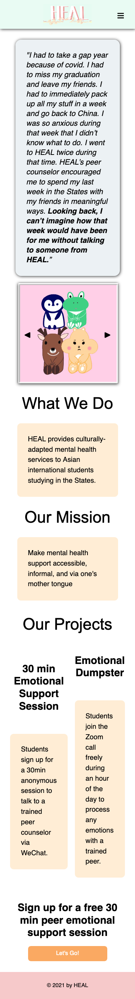
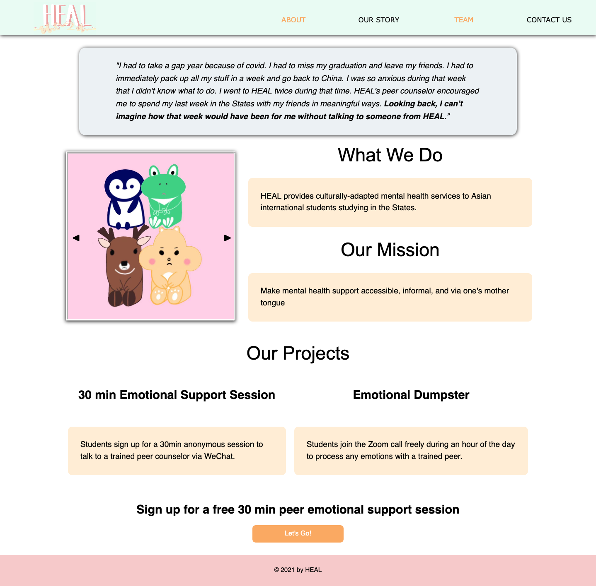
- Increased font size, and changed font family.
- Added color to text boxes.
- Reorganized the layout of the page to make it more coherent and condense.

_Our Story Page_
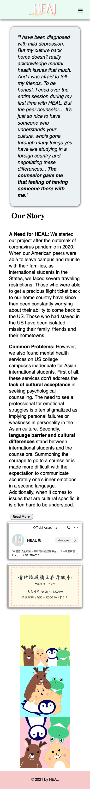
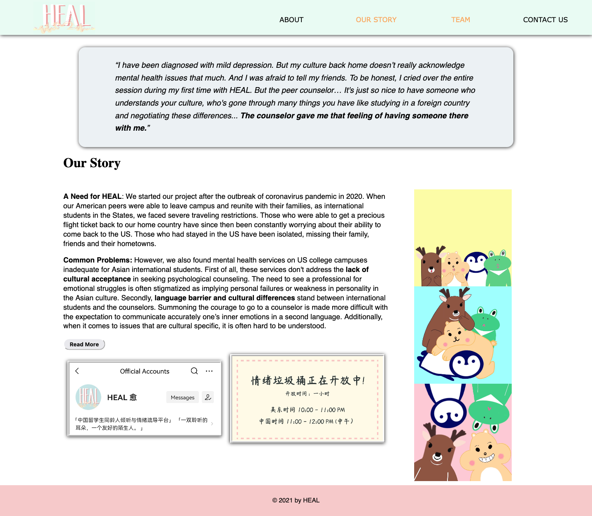
- Made the delineation more clearer
- Added images at the bottom
- Bolded more texts and added subtitles to highlight important words

_Team Page_
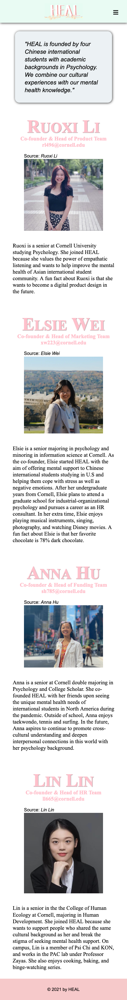
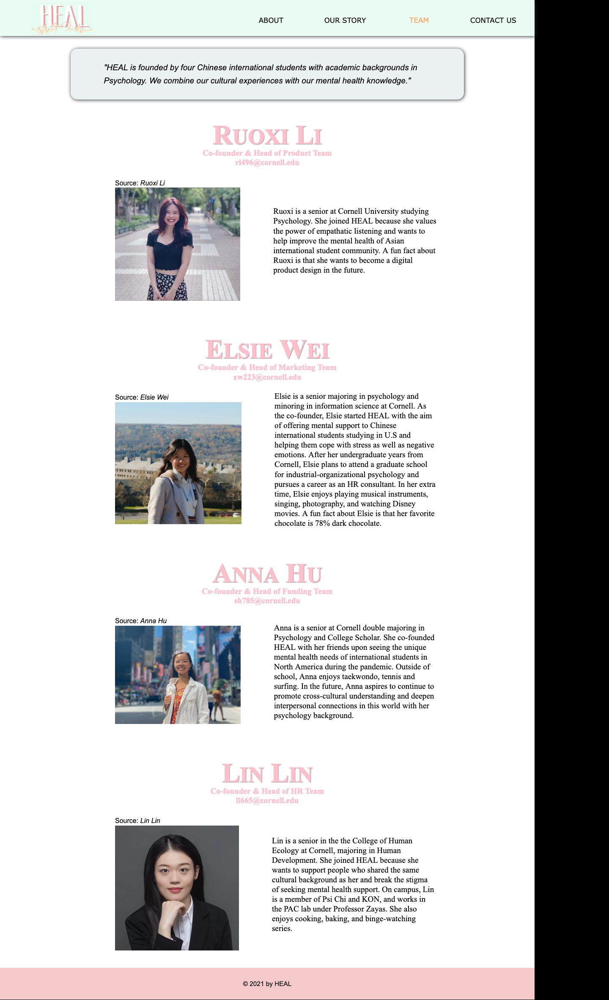
- Add a description of the team at the top of the team page
- Add the position of each team members
- Centered the content of the page

_Contact Us Page_
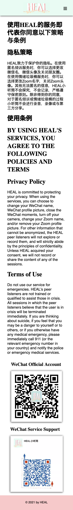
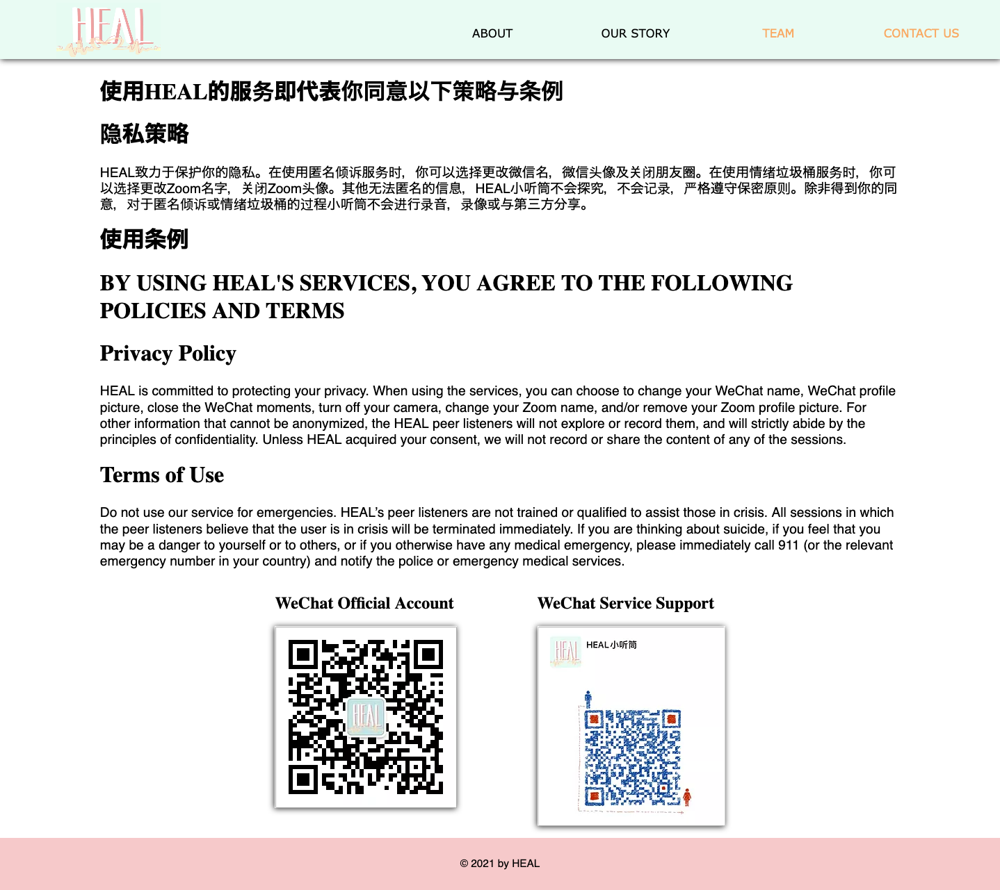
- Added labels to QR codes
- Adjusted font size and font family.

## Final Notes to the Graders (Final Submission)

> 1.  Give us three specific strengths of your site that sets it apart from the previous website of the client (if applicable) and/or from other websites. Think of this as your chance to argue for the things you did really well.

- Makes great use of “don’t make me think” web philosophy; intuitive navigation
- Effective mobile version for the website, that integrates a hamburger menu.
- Strong branding and use of coloring for messaging.

> 2.  Tell us what you, as a team, learned while working on this project.

We learned how to collaborate effectively using the git tool, pushing, pulling, and merging, making sure that we didn’t have any conflicts. At times, it was difficult, because it was a format none of us were used to, but going through the process made us all learn about how web development in the real world setting would look like. It also gave us a glimpse into the industry. In addition, working together as a team, making sure that we were all collaborating was something that we learned. Furthermore, we learned how to get a project done as a group by adhering to the internal deadlines, which is a skill that is really useful in other group works. We also learned how to arrange meetings and communicate with the client effectively.

> 3.  Tell us anything else you need us to know for when we're looking at the project.

The hamburger menu only works for the mobile version.
